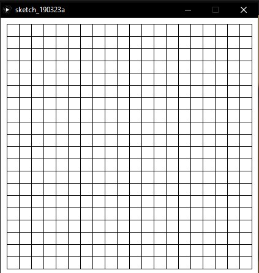
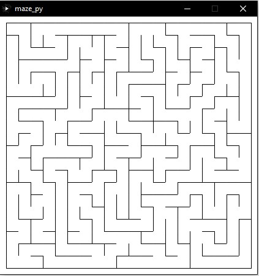
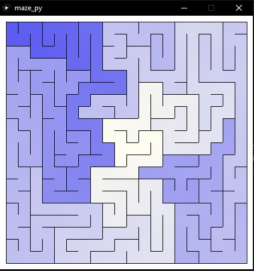

# Làm quen với Processing: Vẽ mê cung và tìm đường đi trong mê cung

## Giới thiệu Processing
Processing là chương trình phác thảo linh hoạt và hỗ trợ thêm các hàm trong Python, Java, ... để thực hiện hóa dưới dạng hình ảnh. Có thể tham khảo thêm các tính năng thú vị, sách hướng dẫn và các hàm hỗ trợ tại trang chủ chính thức của Processing: https://processing.org

Processing hiện tại hỗ trợ ngôn ngữ Java là chính, nhưng ta vẫn có thể cài đặt thêm Python hoặc framework p5.js (Javascript) để code. Trong bài hướng dẫn này mình sẽ code với ngôn ngữ Python, với các ngôn ngữ khác ta vẫn có thể cho kết quả tương tự.

## Vẽ mê cung
Đầu tiên ta cần xác định thuật toán thích hợp để vẽ mê cung và cũng khá thú vị là ta có rất nhiều thuật toán để lựa chọn như là
- Recursive Backtrack
- Kruskal's algorithm
- Recursive Division
- Aldous-Broder Algorithm

Có thể tham khảo thêm các thuật toán thú vị khác tại 2 trang web sau:
- http://jamisbuck.org/mazes/
- https://en.wikipedia.org/wiki/Maze_generation_algorithm

Theo nhận định cá nhân, mình thấy thuật toán Recursive Backtrack khá dễ hiểu và đơn giản để bắt đầu.

Vậy đầu tiên ta cần xác định kích thước mê cung của ta cũng như làm sao để lưu trữ thông tin trên mê cung. Ở đây ta sẽ dùng ma trận 2D với mỗi ô [i, j] là 1 tọa độ vị trí trên mê cung này. Nhưng tại mỗi ô gồm 4 tường - để tạo mê cung thì ta phải phá tường mà đi. 

Vậy tại mỗi vị trí ta cần phải tạo 1 đối tượng Cell để biết tại vị trí này nên phá tường nào.

```python
maze = []
# Độ rộng của mỗi cell
w = 20
cols = rows = 20

class Cell():
    def __init__(self, i, j):
        self.i = i
        self.j = j
        # wall là danh sách phía nào của Cell còn tường
        # tường được xác định theo thứ tự
        # Top - Right - Bot - Left
        self.wall = [True, True, True, True]
        # Cell này đã được kiểm tra khi tạo mê cung chưa
    
    # Vẽ Cell này trên mê cung
    def show(self):
        x = self.i*w + 10
        y = self.j*w + 10
        # Vẽ mỗi tường của Cell này 
        stroke(0)
        if self.wall[0]:
            line(x, y, x+w, y)
        if self.wall[1]:
            line(x+w, y, x+w, y+w)
        if self.wall[2]:
            line(x+w, y+w, x, y+w)
        if self.wall[3]:
            line(x, y+w, x, y)

# Thiết lập các đặc điểm của mê cung
def setup():
    # Thiết lập kích thước của cửa sổ
    size(420,420)
    # Khởi tạo các Cell trên mê cung
    for i in range(rows):
        row = []
        for j in range(cols):
            row.append(Cell(i, j))
        maze.append(row)

# Vẽ mê cung
def draw():
    background(255)
    for i in range(rows):
        for j in range(cols):
            maze[i][j].show()
```
Kết quả là ta sẽ có mê cung ban đầu như thế này: 


Vậy ta có ma trận để tạo nên mê cung, vậy thì ta sẽ bắt đầu thực hiện phá tường ma trận của thuật toán Recursive backtracker:
- Chọn 1 ô bất kỳ làm ô đang được xét hiện tại và đánh dấu ô này đã được thăm.
- Nếu vẫn còn ô chưa thăm thì:
    - Nếu ô hiện tại còn bất kì ô liên thông nào chưa được thăm :
        - Chọn ngẫu nhiên bất kì 1 ô trong số đó.
        - Đẩy ô đang xét vào stack.
        - Xóa tường giữa ô đang xét và ô mới được chọn.
        - Đánh dấu ô mới là ô sẽ được xét tiếp theo.
    - Nếu stack không trống:
        - Lấy 1 ô ra khỏi stack.
        - Chọn ô mới này là ô sẽ được xét tiếp theo.

Vậy với ý tưởng trên ta cần thêm thông tin ô đã được thăm chưa, chọn ngẫu nhiên 1 ô kề và xóa tường giữa 2 ô.
```python
class Cell():
    # Chọn 1 ô kề để phá tường
    def carve_wall(self):
        adjacent = []
        for d in range(4):
            u = self.i + direction[d][0]
            v = self.j + direction[d][1]
            if check_cell(u, v) and maze[u][v].visited == False:
                adjacent.append(maze[u][v])
        if len(adjacent) > 0:
            # Next cell
            return random.choice(adjacent)
        else:
            return None

current = maze[0][0]
def draw():
    global current
    current.visited = True
    next = current.carve_wall()
    if next:
        next.visited = True
        stack.append(next)
        # Remove wall
        remove(current, next)
        current = next
    elif len(stack) > 0:
        current = stack.pop()

# Xóa tường giữa cellA và cellB
def remove(cellA, cellB):
    if cellA.i - cellB.i == 1:
        # Carve top wall
        cellA.wall[3] = False
        cellB.wall[1] = False
    elif cellA.i - cellB.i == -1:
        # Carve bot wall
        cellA.wall[1] = False
        cellB.wall[3] = False
    elif cellA.j - cellB.j == -1:
        # Carve right wall
        cellA.wall[2] = False
        cellB.wall[0] = False
    else:
        # Carve left wall
        cellA.wall[0] = False
        cellB.wall[2] = False
```

Ở đây ta cần lưu ý ở hàm remove - phá tường, do tính chất grid coordinate của Processing nên trục Ox sẽ hướng từ trái sang phải, trục Oy sẽ hướng từ trên xuống dưới, gốc tọa độ ở góc trái trên cửa sổ. Vậy nếu trong ma trận ta đi từ ô trên xuống ô dưới, thì trên Processing sẽ biểu thị ta đi từ ô trái sang phải. Nên khi thay đổi giá trị wall của mỗi ô, ta cần chỉnh lại cho phù hợp.

Do chọn ô kề để phá 1 cách ngẫu nhiên ta sẽ có kết quả tương tự như thế này:


## Tìm đường đi trong mê cung
Từ mê cung này, ta có thể làm được nhiều hơn nữa như tô màu dựa trên quãng đường đi trong mê cung này chẳng hạn. Có vài thuật toán tìm đường đi phù hợp cho việc này, ở đây ta sẽ chọn thuật BFS - Breath First Search để thực hiện việc này.

Vậy để thực hiện việc đánh dấu thăm 1 ô trong BFS và tô màu dựa vào quãng đường, ta sẽ thêm vài thông tin nữa cho mỗi cell.
```python
class Cell():
    def __init__(self, i, j):
        # Đã tham gia BFS chưa
        self.BFS = False
        self.distance = 0
        
        
    def show(self):
        x = self.i*w + 10
        y = self.j*w + 10
        noStroke()
        # Tô để phân biệt ô đã được thăm khi phá tường
        if not self.visited:
            fill(51)
            rect(x, y, w, w)
        else:
            fill(255)
            rect(x, y, w, w)
        # Tô màu dựa vào độ dài đường đi
        # Ta có thể thay đổi khoảng màu RGB tùy ý ở đây
        if self.BFS:
            fill(255 - self.distance, 255 - self.distance, 240)
            rect(x, y, w, w)
```
Vậy mỗi ô đã đủ thông tin để tô màu dựa vào quãng đường đi. Ta có thể bắt đầu thực hiện BFS trên mê cung này.
```python
# Kiểm tra ô có hợp lý hay không
def check_cell(u, v):
    if 0 <= u < rows and 0 <= v < cols:
        return True
    return False

# Kiểm tra có đường đi giữa 2 ô kề nhau không
def check_route(cellA, cellB):
    if cellA.i - cellB.i == 1 and cellA.wall[3] == False:
        return True
    elif cellA.i - cellB.i == -1 and cellA.wall[1] == False :
        return True
    elif cellA.j - cellB.j == -1 and cellA.wall[2] == False:
        return True
    elif cellA.j - cellB.j == 1 and cellA.wall[0] == False:
        return True
    return False

# Thuật toán BFS
def BFS(u, v):
    global cell_queue
    cell_queue.append((u, v))
    maze[u][v].BFS = True
    if len(cell_queue) > 0:
        x, y = cell_queue[0]
        cell_queue = cell_queue[1:]
        for d in range(4):
            i = x + direction[d][0]
            j = y + direction[d][1]
            if check_cell(i, j) and not maze[i][j].BFS and check_route(maze[x][y], maze[i][j]):
                cell_queue.append((i, j))
                maze[i][j].BFS = True
                maze[i][j].distance = maze[x][y].distance + 1
```
Nếu ta chọn điểm chính giữa mê cung vậy ta sẽ có kết quả cuối cùng sẽ như thế này: 


Mã nguồn hoàn chỉnh của chương trình này tại: https://ideone.com/a347ax